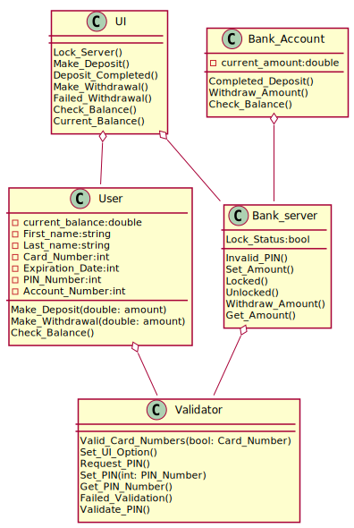
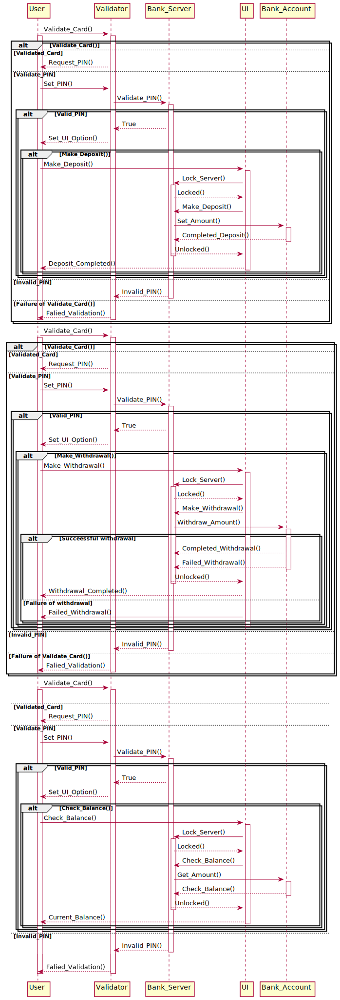

# ATM Machine - *ATM Machine Design*

**ATM Machine Design** is a design of an ATM Machine similar to most Bank ATMs but using PlantUML .

## Functionality

The following functionality is completed:

-  The user should be able to deposit preferred amount of money".
-  The system allows the user to withdraw a selected amount of money given that it has sufficent balance
-  The user can also check the balance its account

## Image

Here's an Image of the designed ATM Machine:

## Notes

## Open-source resources used

- [Lucid Chart Tutorial](https://www.youtube.com/watch?v=UI6lqHOVHic&list=PLUoebdZqEHTxNC7hWPPwLsBmWI0KEhZOd) - covers class, Case, and Sequence Diagram
- [PlantUML](https://plantuml-editor.kkeisuke.com) - a tool allowing users to create a UML diagram from a plain text language  

## License

    Copyright [2020] [GY]

    Licensed under the Apache License, Version 2.0 (the "License");
    you may not use this file except in compliance with the License.
    You may obtain a copy of the License at

        http://www.apache.org/licenses/LICENSE-2.0

    Unless required by applicable law or agreed to in writing, software
    distributed under the License is distributed on an "AS IS" BASIS,
    WITHOUT WARRANTIES OR CONDITIONS OF ANY KIND, either express or implied.
    See the License for the specific language governing permissions and
    limitations under the License.
